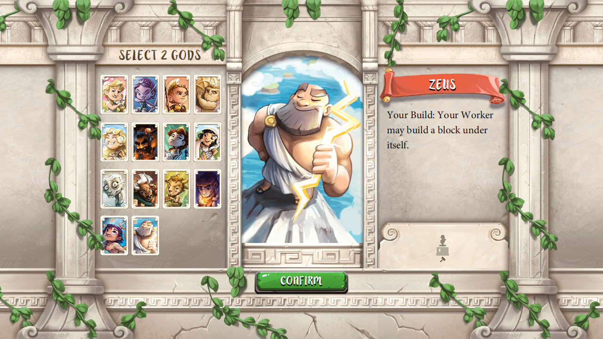
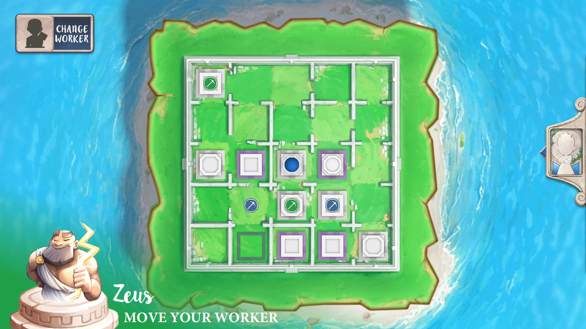
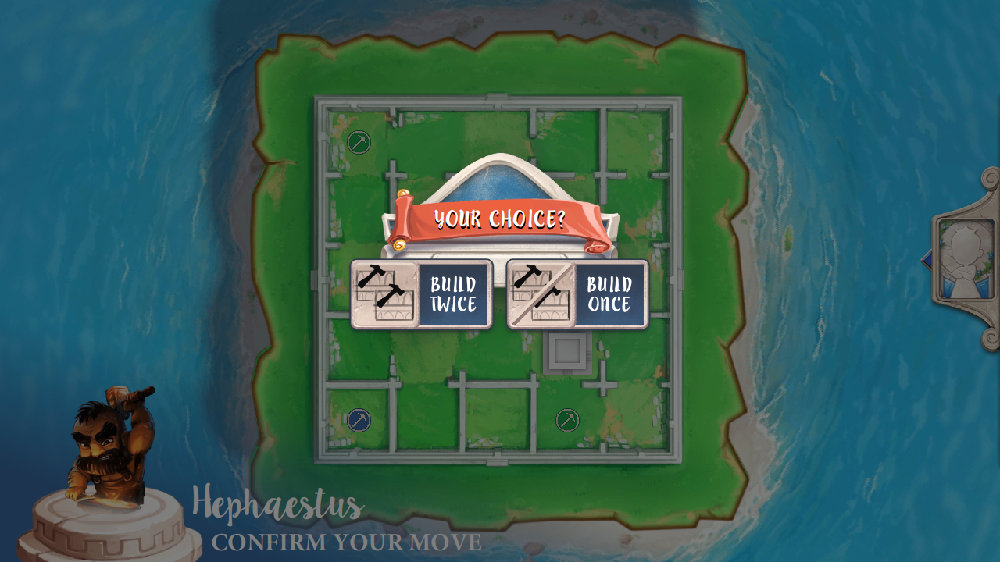
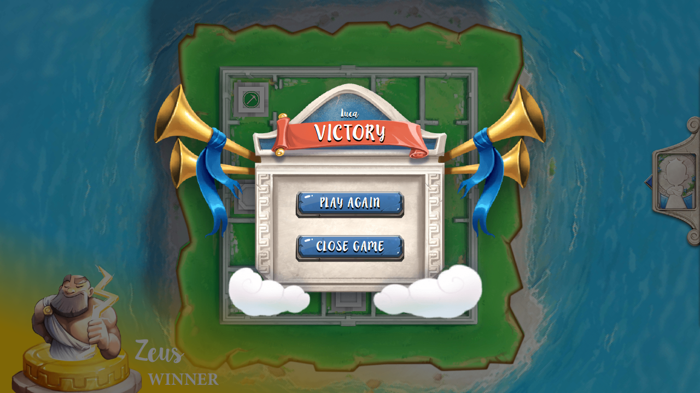

# Software Engineering Project 

This repository contains the code for the exam "Prova Finale (Ingegneria del Software)" held at Politecnico di Milano during spring 2020.  
 
The project consists of a playable Java implementation of the board game ["Santorini"](https://www.youtube.com/watch?v=EZi-MZEylRQ) released in 2004 by Gordon Hamilton. 

## Group Components

- Lorenzo Fratus
- Luca Malagutti
- (Roberto Ferri)

## Implemented Features

- Complete Game Rules
- Socket
- GUI
- CLI
- Advanced Feature: additional gods 
    - Hera, Hestia, Limus, Triton, Zeus
    
## How to run the game

- Both the server and the client JAR can be found in the `deliveries/final/jar/` folder

- To run the server download the server JAR and run

`java -jar santorini_server_4.jar`

- To run the client as a GUI download the client JAR and run

`java -jar santorini_client_4.jar`

- To run the Command Line version of the game run

`java -jar santorini_client_4.jar cli`

- To recompile the JARs, run the 'maven package' command after selecting the corresponding profile in the pom.xml file

- When playing locally with multiple clients, select "0.0.0.0" as the server IP address

## Screenshots from the game 

God selection screen:

Game board:

God ability screen:

Victory screen:

